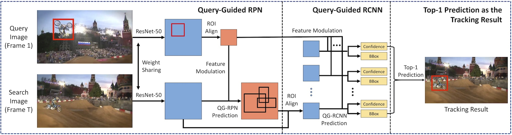

# GlobalTrack

Official implementation of our AAAI2020 paper: GlobalTrack: A Simple and Strong Baseline for Long-term Tracking. **The first tracker with NO cumulative errors.**

Extremely simple architecture, with **NO motion model, NO online learning, NO punishment on position or scale changes, NO scale smoothing and NO trajectory refinement**.

Outperforms [SPLT](https://github.com/iiau-tracker/SPLT) (ICCV19) on [TLP](https://amoudgl.github.io/tlp/) benchmark (avg. **13,529 frames** per video) by **OVER 11%** (absolute gain).

Outperforms [SiamRPN++](https://github.com/STVIR/pysot) and [ATOM](https://github.com/visionml/pytracking) on [LaSOT](https://cis.temple.edu/lasot/) benchmark.

Paper on arXiv: [1912.08531](https://arxiv.org/abs/1912.08531).

Code will be made available soon.
